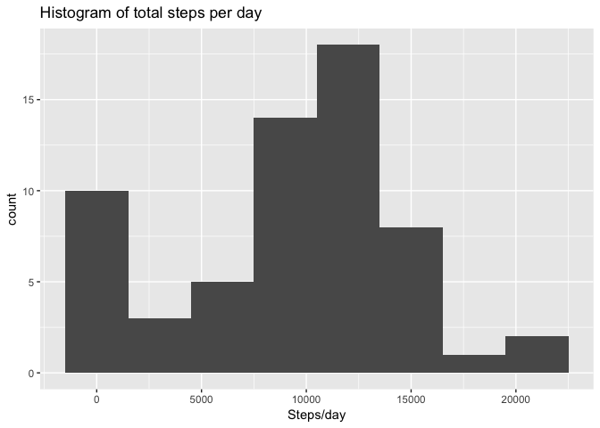

# Reproduciple Research: Week 2 Assignment

*Marek Ostaszewski*
*7/25/2017*


## Introduction

This is a report for the week 2 assignment of Reproducible Research course. It involves loading, processing and analysis of wearable sensor data. I'm loading dplyr, lubridate and ggplot2 libraries, as I'll rely on them in my report.


```r
library(dplyr)
```

```
## 
## Attaching package: 'dplyr'
```

```
## The following objects are masked from 'package:stats':
## 
##     filter, lag
```

```
## The following objects are masked from 'package:base':
## 
##     intersect, setdiff, setequal, union
```

```r
library(lubridate)
```

```
## 
## Attaching package: 'lubridate'
```

```
## The following object is masked from 'package:base':
## 
##     date
```

```r
library(ggplot2)
```

## Loading and preprocessing the data

The dataset is downloaded and read using read.table() from the on-the-fly unzipped file, which is turned into a 'tibbl'. I'm using lubridate to conveniently process the dates into the correct format. The dplyr will help with clean pipelines later.


```r
if(!file.exists("activity.zip")) {
    download.file("https://d396qusza40orc.cloudfront.net/repdata%2Fdata%2Factivity.zip",
                  destfile = "activity.zip")
}
data <- tbl_df(read.table(unzip("activity.zip"), header = TRUE, sep = ","))
data$date <- ymd(data$date)
```

## What is mean total number of steps taken per day?

### 1. Histogram of the total number of steps taken each day

Having the correctly encoded date, I can group entries by *date* and sum *steps* by group. With this I can draw a histogram of steps per day.


```r
daysteps <- data %>% 
            group_by(date) %>% 
            summarize(steps.per.day = sum(steps, na.rm = TRUE))
qplot(data = daysteps, steps.per.day, binwidth = 3000, main = "Histogram of total steps per day") + 
            scale_x_continuous(name = "Steps/day")
```

<!-- -->

### 2. Mean and median number of steps taken each day

We can use the **daysteps** table from the previous part to report the mean and the median.


```r
mean(daysteps$steps.per.day)
```

```
## [1] 9354.23
```

```r
median(daysteps$steps.per.day)
```

```
## [1] 10395
```

## What is the average daily activity pattern?

### 1. Time series plot of the average number of steps taken

Here is the time series plot of the 5-minute interval (x-axis) and the average number of steps taken, averaged across all days (y-axis). **ivalsteps** is a table from grouping by *interval* and adding all the values in groups.


```r
ivalsteps <- data %>% 
              group_by(interval) %>% 
              summarize(steps.per.interval = mean(steps, na.rm = TRUE))
qplot(data = ivalsteps, x = interval, y = steps.per.interval, geom = "line", 
            main = "Average nb of steps per 5 min interval, over all days") +
            scale_x_continuous(name = "5 minute intervals") +
            scale_y_continuous(name = "Nb of steps (mean)")
```

<!-- -->

### 2. The 5-minute interval that, on average, contains the maximum number of steps

Here's the 5-minute interval, on average across all the days in the dataset, that contains the maximum number of steps.


```r
with(ivalsteps, interval[which.max(steps.per.interval)])
```

```
## [1] 835
```

From the interval id we can conclude it was 8:35 AM. The subject moves the most, on average, in the morning.

## Imputing missing values

### 1. Calculate and report the total number of missing values in the dataset (i.e. the total number of rows with NAs)

Here's the calculation and report of the total number of missing values in the dataset.


```r
sum(is.na(data$steps))
```

```
## [1] 2304
```

### 2. Devise a strategy for filling in all of the missing values in the dataset

Here's how the new dataset is created, with imputed NA values.
The missing step values will be replaced per 5-min time interval, by the mean value for this interval for the entire dataset.

### 3. Create a new dataset that is equal to the original dataset but with the missing data filled in.

I'm adding a new column to the **data** table, called *imputed.steps*, taking the mean value from previously calculated **ivalsteps**. The shape is different from the previous histogram, especially at the bin containing 0 value.


```r
new.data <- data
for(row in which(is.na(new.data$steps))) {
  new.data$steps[row] = ivalsteps$steps.per.interval[ivalsteps$interval == new.data$interval[row]]
}
```

### 4. Histogram, mean and median of the total number of steps taken each day after missing values are imputed

Here is a histogram of the total number of steps taken each day in the new dataset.


```r
new.daysteps <- new.data %>% 
                group_by(date) %>% 
                summarize(steps.per.day = sum(steps))
qplot(data = new.daysteps, steps.per.day, binwidth = 3000, 
              main = "Histogram of total steps/day with imputed NAs") + 
              scale_x_continuous(name = "Steps/day")
```

<!-- -->

Here are the values of the mean and median total number of steps taken per day.


```r
mean(new.daysteps$steps.per.day)
```

```
## [1] 10766.19
```

```r
median(new.daysteps$steps.per.day)
```

```
## [1] 10766.19
```

As we can see, these values are different than the corresponding estimates from earlier part of the assignment.  
Both mean and median have increased, and they are equal.

## Are there differences in activity patterns between weekdays and weekends?

### 1. Create a new factor variable in the dataset with two levels, "Weekday" and "Weekend"

I'm creating the new factor variable, *tow* (time of the week), equal to "Weekend" for Daturday and Sunday, and to "Weekday" on other days.


```r
we = c("Saturday","Sunday")
new.data <- mutate(new.data, tow = as.factor(ifelse(weekdays(date) %in% we, "Weekend", "Weekday")))
```

### 2. Make a panel plot containing a time series plot of the 5-minute interval and the number of steps averaged across weekdays or weekends.

I'm creating interval averages, grouping by *interval* and *tow* and averaging the steps in each group. This is for the imputed dataset. This data is used for panel plot comparing the average number of steps per interval between weekends and weekdays.


```r
new.ivalsteps.tow <- new.data %>%
                      group_by(interval, tow) %>% 
                      summarize(steps.per.interval = mean(steps))

qplot(data = new.ivalsteps.tow, x = interval, y = steps.per.interval, geom = "line", facets = tow ~ ., 
            main = "Average nb of steps per 5 min interval, over weekends and weekdays") +
            scale_x_continuous(name = "5 minute intervals") +
            scale_y_continuous(name = "Nb of steps (mean)")
```

<!-- -->

From the figure above we can see that on weekends the subject moade more steps, on average, in the afternoon, and his/her morning activity was more intensive on weekdays.
